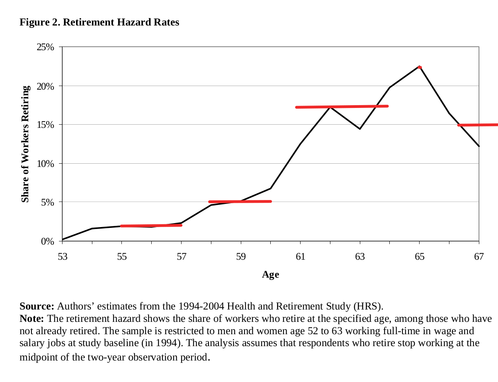

```{r}
# libraries-----------
library(tidyverse)
library(plotly)
# constants--------------
hazard_final <- 1
# read files--------------
bc_pop <- read_rds(here::here("processed_data", "bc_pop.rds")) %>%
  mutate(ref_date = as.numeric(ref_date)) %>%
  filter(age_group < 72,
         ref_date>1975)
reported <- read_rds(here::here("processed_data", "retirements.rds"))
participation <- read_rds(here::here("processed_data", "participation.rds"))

labour_force_participants <- full_join(bc_pop, participation, by=c("ref_date"="Year","sex"="Sex"))%>%
  mutate(value=value*`Participation Rate`)%>%
  select(-`Participation Rate`)


# functions--------------------
compare_plot <- function(tbbl, ylim) {
  ggplot(tbbl, aes(ref_date,
    value,
    colour = name,
    group = sex,
    text = paste(
      "The",
      name,
      "\n in",
      ref_date,
      "is",
      scales::comma(value, accuracy = 1)
    )
  )) +
    geom_line() +
    scale_y_continuous(labels = scales::comma, limits = c(0, ylim)) +
    labs(
      title = "Reported vs. Estimated retirements",
      colour = "",
      x = "",
      y = ""
    ) +
    facet_wrap(~sex) +
    theme(legend.position = "bottom") +
    scale_colour_brewer(palette = "Dark2")
}
```

Introduction
=====================================  

-   This app predicts British Columbia "retirement" numbers based on demographic data and labour force participation rates, both observed and forecasted.
-   The definition of retirement is broad: permanent exit from the labour market, whether above or below ground.
-   The main driver of retirements is the number of labour force participants at risk of retirement: the number of people of retirement age (55-71) who are/were labour force participants.
-   This at risk population is estimated by multiplying the number of people between the ages of 55 and 71 by the labour force participation rate of those aged 50-54.
-   For the app the user specifies hazard rates for retirement, which is the probability of retirement in the current year, conditional on "survival" i.e. you have not previously retired.
-   The expected number of retirements in a year depends on the joint probability distribution: the probability of survival AND retirement at this age.
-   The joint probability is the product of the hazard rate with the probability of survival.
-   For each age group, the expected number of retirements in a year is the product of the joint probability and the number of labour force participants at risk of retirement. 
-   The *total* expected retirements is the sum of each age's expected retirements. 

#### A simple example

-   Suppose that demographics are unchanging: there are 40,000 females of each age in B.C.
-   Further, suppose that the labour force participation rate is $.8$ for females approaching retirement age.
-   This implies 32,000 females of each age are at risk of retirement.
-   Suppose the hazard rate is $.5$ for those age 55-59. i.e. conditional on not having retired yet, there is a 50/50 chance of retiring this year.
-   Assume that the hazard rate is $0$ for those age 0-54 and at age 60 all remaining workers retire i.e. hazard rate of 1.


```{r}
tbbl <- tibble(
  Age = 55:60,
  population = rep(40000, 6),
  `at risk for retirement` = rep(32000, 6),
  `hazard rate` = c(rep(.5, 5), 1),
  `probability of survival` = .5^(0:5)
) %>%
  mutate(
    `joint probability` = `hazard rate` * `probability of survival`,
    `retirements this year` = `at risk for retirement` * `joint probability`
  ) %>%
  mutate_all(scales::comma)

knitr::kable(t(tbbl)) %>%
  kableExtra::kable_styling(full_width = F)
```

-   So in this example the annual total expected retirements is $32,000$.

Inputs {data-orientation=rows}
=====================================     
   
Row {data-height=900}
-------------------------------------

### The age pyramid illustrates the number of people of each age/sex combination in B.C. Horizontal grey band indicates retirement years.

```{r}
plotly::renderPlotly({
  age_pyramid <- ggplot(data = bc_pop) +
    # retire_distribution() which is defined line 236ish just gives us the ages of retirement.
    geom_hline(data = retire_distribution(), aes(yintercept = Age), alpha = .25, colour = "gray60", lwd = 2) +
    geom_point(
      mapping = aes(
        x = ifelse(sex == "Males", -value, value),
        y = age_group,
        fill = sex,
        frame = ref_date,
        text = paste(
          "In",
          ref_date,
          "the number of",
          sex,
          "of age",
          age_group,
          if_else(ref_date < 2022, "was", "is expected to be"),
          scales::comma(value)
        )
      )
    ) +
    lemon::scale_x_symmetric(labels = abs) +
    labs(
      title = "B.C. Population by age, sex and year",
      x = "",
      y = "Age"
    )
  plotly::ggplotly(age_pyramid, tooltip = "text") %>%
    plotly::animation_opts(transition = 0) %>%
    config(displayModeBar = F)
}) %>%
  bindCache("pyramid")
```

### The Labour Force Participation Rates give the proportion of the population that is at risk of retirement.

```{r}
plotly::renderPlotly({
  plt <- ggplot(participation, aes(Year,
    `Participation Rate`,
    colour = fct_rev(Sex),
    group = fct_rev(Sex),
    text = paste(
      "The labour force participation rate for \n",
      str_to_lower(Sex),
      "in",
      Year,
      if_else(Year>lubridate::year(lubridate::today()), "is forecast to be","was"),
      scales::percent(`Participation Rate`, accuracy = .1)
    )
  )) +
    geom_line() +
    labs(colour="Sex",
      title = "Labour Force Participation Rate: ages 50-54")+
    scale_y_continuous(labels=scales::percent)
  plotly::ggplotly(plt, tooltip = "text") %>%
    config(displayModeBar = F)
}) %>%
  bindCache("participation")
```

Row {data-height=100}
-------------------------------------

###
- <span class='bigger'>&uarr;</span> Hit the play button to see the population size change over time.
-   Historical data from Statistics Canada table 17-10-0005-01 and projections from https://bcstats.shinyapps.io/popApp/

###

-   Historical data from Statistics Canada table 14-10-0017-01 and forecasts via exponential smoothing. 

Output {data-orientation=columns}
=====================================  

Inputs {.sidebar}
-------------------------------------


```{r}

HTML("<br>")

actionButton("reset", "Reset sliders")

HTML("<br>")
HTML("<br>")

sliderInput("hazard_55_57", "Hazard rate age 55-57?",
  min = 0, max = 1,
  value = .02
)
sliderInput("hazard_58_60", "Hazard rate age 58-60?",
  min = 0, max = 1,
  value = .05
)
sliderInput("hazard_61_64", "Hazard rate age 61-64?",
  min = 0, max = 1,
  value = .17
)
sliderInput("hazard_65", "Hazard rate at age 65?",
  min = 0, max = 1,
  value = .22
)
sliderInput("hazard_66_70", "Hazard rate age 66-70?",
  min = 0, max = 1,
  value = .15
)
observeEvent(input$reset, {
  updateSliderInput(inputId = "hazard_55_57", value = .02)
  updateSliderInput(inputId = "hazard_58_60", value = .05)
  updateSliderInput(inputId = "hazard_61_64", value = .15)
  updateSliderInput(inputId = "hazard_65", value = .22)
  updateSliderInput(inputId = "hazard_66_70", value = .15)
})
```

```{r}
retire_distribution <- reactive({
  Age <- 55:71
  `Hazard Rate` <- c(
    rep(input$hazard_55_57, 3),
    rep(input$hazard_58_60, 3),
    rep(input$hazard_61_64, 4),
    input$hazard_65,
    rep(input$hazard_66_70, 5),
    hazard_final
  )
  tbbl <- tibble(Age, `Hazard Rate`) %>%
    mutate(`Probability of Survival` = lag(cumprod(1 - `Hazard Rate`)))
  tbbl$`Probability of Survival`[1] <- 1
  tbbl <- tbbl %>%
    mutate(`Joint Probability` = `Hazard Rate` * `Probability of Survival`)
})

both <- reactive({
  estimated <- labour_force_participants %>%
    filter(age_group %in% 55:71) %>%
    group_by(ref_date, sex) %>%
    dplyr::rename(`population based estimate` = value)

  weights <- retire_distribution() %>%
    select(age_group = Age, `Joint Probability`)

  estimated <- full_join(estimated, weights) %>%
    mutate(`population based estimate` = `population based estimate` * `Joint Probability`) %>%
    group_by(ref_date, sex) %>%
    summarize(`population based estimate` = sum(`population based estimate`)) %>%
    pivot_wider(id_cols = ref_date, names_from = sex, values_from = `population based estimate`) %>%
    mutate(`Both Sexes` = Males + Females) %>%
    pivot_longer(cols = -ref_date, names_to = "sex", values_to = "population based estimate") %>%
    mutate(`population based estimate` = round(`population based estimate`))

  reported <- reported %>%
    select(ref_date, `reported retirements` = val_norm, sex) %>%
    mutate(ref_date = as.numeric(ref_date)) %>%
    pivot_wider(id_cols = ref_date, names_from = sex, values_from = `reported retirements`) %>%
    mutate(`Both Sexes` = Males + Females) %>%
    pivot_longer(cols = -ref_date, names_to = "sex", values_to = "reported retirements: Statistics Canada table 14-10-0126-01")

  full_join(estimated, reported) %>%
    pivot_longer(cols = c("population based estimate", "reported retirements: Statistics Canada table 14-10-0126-01"), names_to = "name", values_to = "value")
})
```

Column {.tabset}
--------------------------------------

### Plot

```{r}
plotly::renderPlotly({
  plt <- ggplot(retire_distribution(), aes(
    x = factor(Age),
    y = `Joint Probability`,
    text = paste(
      scales::percent(`Joint Probability`, accuracy = .01),
      "of people retire at",
      Age
    )
  )) +
    geom_col() +
    scale_y_continuous(label = scales::percent, limits = c(0, 1)) +
    labs(
      title = "Joint probability distribution of retirement age",
      x = "Age",
      y = ""
    )
  plotly::ggplotly(plt, tooltip = "text") %>%
    config(displayModeBar = F)
})
```

### Table

```{r}
DT::renderDataTable(server = FALSE, {
  retire_distribution() %>%
    mutate(across(!Age, scales::comma, accuracy = .0001)) %>%
    DT::datatable(
      extensions = "Buttons",
      rownames = FALSE,
      options = list(
        columnDefs = list(list(className = "dt-center", targets = "_all")),
        paging = TRUE,
        scrollX = TRUE,
        scrollY = TRUE,
        searching = TRUE,
        ordering = TRUE,
        dom = "Btip",
        buttons = list(
          list(extend = "csv", filename = input$name),
          list(extend = "excel", filename = input$name)
        ),
        pageLength = 10,
        lengthMenu = c(3, 5)
      )
    )
})
```

Column {.tabset}
--------------------------------------

### Both Sexes

```{r}
plotly::renderPlotly({
  plt <- compare_plot(filter(both(), sex == "Both Sexes"), 80000)
  plotly::ggplotly(plt, tooltip = "text") %>%
    layout(legend = list(
      orientation = "h"
    )) %>%
    config(displayModeBar = F)
})
```

### By Sex

```{r}
plotly::renderPlotly({
  plt <- compare_plot(filter(both(), sex != "Both Sexes"), 40000)
  plotly::ggplotly(plt, tooltip = "text") %>%
    layout(legend = list(
      orientation = "h"
    )) %>%
    config(displayModeBar = F)
})
```

### Table

```{r}
DT::renderDataTable(server = FALSE, {
  both() %>%
    DT::datatable(
      extensions = "Buttons",
      rownames = FALSE,
      options = list(
        columnDefs = list(list(className = "dt-center", targets = "_all")),
        paging = TRUE,
        scrollX = TRUE,
        scrollY = TRUE,
        searching = TRUE,
        ordering = TRUE,
        dom = "Btip",
        buttons = list(
          list(extend = "csv", filename = input$name),
          list(extend = "excel", filename = input$name)
        ),
        pageLength = 10,
        lengthMenu = c(3, 5)
      )
    )
})
```


# Assumptions/References/Appendix {data-orientation=rows}

Row {data-height=200}
-------------------------------------

### Assumptions

-   Demographic data (historic and forecasts) are accurate.
-   Labour force participation rate data (historic and forecasts) are accurate.
-   All retirements occur between the ages of 55 and 71.
-   Hazard rates are similar to those in the USA in the early 2000's [@johnson2008].

Row {data-height=100}
-------------------------------------
### References

::: {#refs}
:::

Row {data-height=900}
-------------------------------------
### Appendix: (added utilized hazard rates in red)


